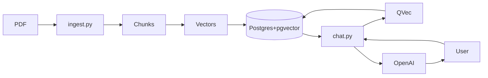

```mermaid
flowchart LR
PDF-->Ingest[ingest.py]
Ingest-->Chunks
Chunks-->Vectors
Vectors-->PG[(Postgres+pgvector)]
User-->Chat[chat.py]
Chat-->QVec
QVec-->PG
PG-->Chat
Chat-->OpenAI
OpenAI-->User
```
